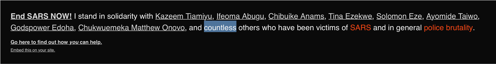

# I Stand

A web component to embed in your personal site to show you stand with the protests against racism and police brutality.



To add this banner to your site, include the following code:

```html
<!-- Somewhere in your page -->
<script src="https://unpkg.com/sars-stand/black-lives.js" type="module"></script>

<!-- After the opening <body> tag -->
<black-lives></black-lives>
```

The snippet above will always use the latest version of the banner. This means if any changes are published they'll automatically be pulled in (such as new names or updated links).

_This should work in all modern browsers. If you need to support legacy browsers, you may need to include some polyfills or run the script through a transpiler, like [Babel](https://babeljs.io/), first._
